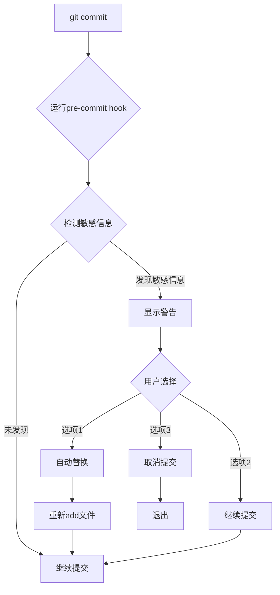

# 🔒 敏感信息自动检测与处理

**版本：** 1.0.0
**更新时间：** 2026-03-02

---

## 📋 功能说明

**Pre-commit Hook** 会在每次git提交前自动：
1. 🔍 检测所有待提交文件中的敏感信息
2. ⚠️ 发现敏感信息时提醒用户
3. 🔧 提供自动替换选项
4. ✅ 确保不会意外提交敏感信息

---

## 🎯 检测的敏感信息类型

### 1️⃣ 手机号码
**模式：** `+86 XXX XXXX XXXX`
**替换为：** `+86 YOUR_PHONE_NUMBER`

**示例：**
```json
// 检测到
"phoneNumber": "+86 YOUR_PHONE_NUMBER"

// 替换为
"phoneNumber": "+86 YOUR_PHONE_NUMBER"
```

### 2️⃣ QQ邮箱
**模式：** `XXXXXXXXX@qq.com`
**替换为：** `YOUR_EMAIL@qq.com`

**示例：**
```json
// 检测到
"address": "YOUR_EMAIL@qq.com"

// 替换为
"address": "YOUR_EMAIL@qq.com"
```

### 3️⃣ SMTP授权码
**模式：** 16位字母（在authCode字段中）
**替换为：** `YOUR_SMTP_AUTH_CODE`

**示例：**
```json
// 检测到
"authCode": "YOUR_SMTP_AUTH_CODE"

// 替换为
"authCode": "YOUR_SMTP_AUTH_CODE"
```

---

## 🚀 使用流程

### 正常提交（无敏感信息）
```bash
git add .
git commit -m "update"
# ✅ 未发现敏感信息
# 提交继续进行
```

### 发现敏感信息时
```bash
git add .
git commit -m "update"

# 输出：
🔍 正在检查敏感信息...
🚨 警告：发现敏感信息！
================================
⚠️  发现手机号：config.json
5:    "phoneNumber": "+86 YOUR_PHONE_NUMBER",
⚠️  发现QQ邮箱：config.json
8:    "address": "YOUR_EMAIL@qq.com",
================================

请选择处理方式：
1) 自动替换敏感信息（推荐）
2) 继续提交（不推荐，会泄露隐私）
3) 取消提交

请输入选项 [1-3]:
```

### 选项说明

**选项1：自动替换（推荐）**
- ✅ 自动替换所有敏感信息为占位符
- ✅ 重新添加文件到暂存区
- ✅ 继续提交

**选项2：继续提交（不推荐）**
- ⚠️ 会泄露隐私
- ⚠️ 需要二次确认

**选项3：取消提交**
- ❌ 取消本次提交
- 💡 手动修改后再提交

---

## 🔧 安装配置

### 自动安装（推荐）

**已自动安装到：**
- `~/Desktop/stock-analysis-github/.git/hooks/pre-commit`

**Hook文件位置：**
- `~/.openclaw/skills/stock-wechat/scripts/pre-commit`

### 手动安装

**如果需要在其他仓库安装：**
```bash
# 复制hook脚本
cp ~/.openclaw/skills/stock-wechat/scripts/pre-commit .git/hooks/

# 添加执行权限
chmod +x .git/hooks/pre-commit

# 测试hook
.git/hooks/pre-commit
```

### 卸载hook

**如果需要禁用自动检测：**
```bash
# 临时禁用（跳过hook）
git commit --no-verify -m "message"

# 永久禁用（删除hook）
rm .git/hooks/pre-commit
```

---

## 📝 检查范围

### 检查的文件类型
- ✅ `*.json` - JSON配置文件
- ✅ `*.md` - Markdown文档
- ✅ `*.txt` - 文本文件

### 不检查的文件类型
- ❌ `*.jpg`, `*.png` - 图片文件
- ❌ `*.pdf` - PDF文件
- ❌ 二进制文件

---

## ⚙️ 高级配置

### 自定义敏感信息模式

**编辑hook脚本：**
```bash
vim ~/.openclaw/skills/stock-wechat/scripts/pre-commit
```

**添加新的检测模式：**
```bash
PATTERNS=(
    "+86 [0-9]{11}"           # 中国手机号
    "[0-9]{9}@qq\\.com"        # QQ邮箱
    "[a-z]{16}"                # 16位授权码
    "YOUR_CUSTOM_PATTERN"      # 自定义模式
)
```

### 跳过特定文件

**在hook脚本中添加排除规则：**
```bash
# 跳过测试文件
if [[ "$FILE" == *test* ]]; then
    continue
fi
```

---

## 🧪 测试Hook

### 测试命令
```bash
# 创建测试文件
echo '{"phone": "+86 13800000000"}' > test.json
git add test.json

# 尝试提交（应该会触发检测）
git commit -m "test"
```

### 预期结果
```
🔍 正在检查敏感信息...
🚨 警告：发现敏感信息！
...
```

---

## 🛠️ 故障排查

### Hook不工作

**检查权限：**
```bash
ls -la .git/hooks/pre-commit
# 应该显示：-rwxr-xr-x
```

**检查脚本：**
```bash
cat .git/hooks/pre-commit
```

### 误报问题

**如果正常内容被误判：**
1. 编辑hook脚本
2. 调整正则表达式
3. 添加排除规则

---

## 📊 工作原理



---

## 🔐 安全建议

### ✅ 推荐做法
1. **始终使用选项1** - 自动替换敏感信息
2. **定期检查** - 查看GitHub仓库是否有敏感信息
3. **使用.env文件** - 将敏感信息放在本地配置文件
4. **双重确认** - 提交前再次检查

### ❌ 不推荐做法
1. 使用选项2继续提交敏感信息
2. 禁用hook
3. 使用`--no-verify`跳过检查

---

## 📞 技术支持

**如有问题：**
1. 检查hook脚本：`.git/hooks/pre-commit`
2. 查看日志：`git log`
3. 手动测试：`.git/hooks/pre-commit`

**相关文档：**
- Git Hooks文档：https://git-scm.com/docs/githooks
- 敏感信息管理：`CONFIG.md`

---

_最后更新：2026-03-02_
_作者：OpenClaw Stock Analysis Skill_
